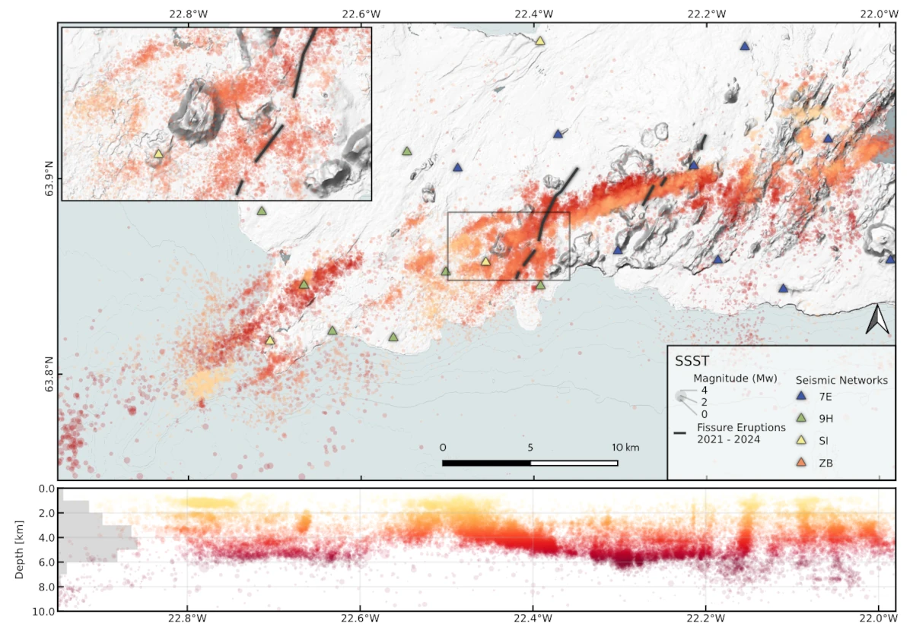

# Qseek

*Data-driven earthquake detection and localization*

[](https://github.com/astral-sh/uv)
[](https://github.com/astral-sh/ruff)
[](https://github.com/j178/prek)
[](https://python.org/)
[](https://pypi.org/project/qseek/)
[](https://pyrocko.github.io/qseek/)

Qseek detects and locates earthquakes in large seismic data sets. It stacks machine learning phase annotations along modeled travel times and focuses an adaptive octree on the seismic sources, in continuous archives and in real time.



*More than 30 000 earthquakes detected during the 2020 unrest on the Reykjanes Peninsula, Iceland.*

## Features

- Phase detection with machine learning pickers from [SeisBench](https://github.com/seisbench/seisbench), pre-trained on different data sets:
  - [PhaseNet (Zhu and Beroza, 2019)](https://doi.org/10.1093/gji/ggy423)
  - [EQTransformer (Mousavi et al., 2020)](https://doi.org/10.1038/s41467-020-17591-w)
  - [OBSTransformer (Niksejel and Zhang, 2024)](https://doi.org/10.1093/gji/ggae049)
  - LFEDetect
- STA/LTA phase detection, adapted from [QuakeMigrate](https://github.com/QuakeMigrate/QuakeMigrate)
- Travel times:
  - Constant velocity
  - 1D layered velocity models (fast marching and Pyrocko Cake)
  - 3D fast marching velocity models (NonLinLoc compatible)
- Magnitudes and other event features:
  - Local magnitudes (ML) with regional attenuation models
  - Moment magnitudes (Mw) from modeled peak amplitudes ([Dahm et al., 2024](https://doi.org/10.26443/seismica.v3i2.1205))
  - Ground motions (PGA, PGV)
- Station corrections:
  - SST: station-specific corrections
  - SSST: source-specific station corrections
- Real-time monitoring of SeedLink streams with alerts
- A web UI to explore the detections

Qseek is built on [Pyrocko](https://pyrocko.org).

## Documentation

The documentation is at <https://pyrocko.github.io/qseek/>.

## Installation

Install Qseek from [PyPI](https://pypi.org/project/qseek/):

```sh
pip install qseek
```

Pre-built packages are available for Linux (x86_64, aarch64) and macOS 15 or newer (arm64, x86_64). The x86_64 packages require a CPU with AVX2 and FMA; on older CPUs, install from source with `pip install --no-binary qseek qseek`.

Install the development version from GitHub:

```sh
pip install git+https://github.com/pyrocko/qseek
```

## Quick start

Create a configuration, add your stations, waveform data and velocity model, and start the search:

```sh
qseek config > my-search.json
qseek search my-search.json
```

The detections are written into the run directory `my-search/`.

## Development

Install Qseek from the repository with [uv](https://github.com/astral-sh/uv) and set up the [prek](https://github.com/j178/prek) hooks:

```sh
cd qseek
uv sync --dev
prek install
```

Contributions and merge requests are welcome!

## Citation

Please cite Qseek as:

> Isken, M., Niemz, P., Münchmeyer, J., Büyükakpınar, P., Heimann, S., Cesca, S., Vasyura-Bathke, H., & Dahm, T. (2025). Qseek: A data-driven Framework for Automated Earthquake Detection, Localization and Characterization. Seismica, 4(1). <https://doi.org/10.26443/seismica.v4i1.1283>

## License

Qseek was written by Marius Paul Isken and is licensed under the GNU General Public License v3.
