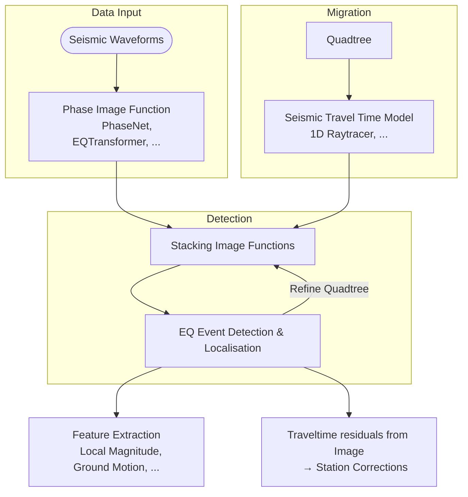

# Lassie Configuration

At center is a JSON configuration file which is parsed by [Pydantic](https://docs.pydantic.dev/). The following pages will detail how to setup this JSON file for the search.

Also see the [getting started guide](../getting_started.md) for a brief introduction into the CLI.

[General configuration conventions](general.md) are outlines in this guide as well.

## The Search

The search configuration. **This is the entrypoint for the EQ detection and localisation**.
More information on the submodules (e.g. Octree, Data Provider and other) can be found on subpages in the navigation.

```python exec='on'
from lassie.utils import generate_docs
from lassie.search import Search

print(generate_docs(Search()))
```

## Minimal Config

This is a minimal config which can used to start a Lassie search.

```json title="Minimal Lassie Config"
{
  "project_dir": ".",
  "stations": {
    "station_xmls": [],
    "pyrocko_station_yamls": ["search/pyrocko-stations.yaml"],
  },
  "data_provider": {
    "provider": "PyrockoSquirrel",
    "environment": ".",
    "waveform_dirs": ["data/"],
  },
  "octree": {
    "location": {
      "lat": 0.0,
      "lon": 0.0,
      "east_shift": 0.0,
      "north_shift": 0.0,
      "elevation": 0.0,
      "depth": 0.0
    },
    "size_initial": 2000.0,
    "size_limit": 500.0,
    "east_bounds": [
      -10000.0,
      10000.0
    ],
    "north_bounds": [
      -10000.0,
      10000.0
    ],
    "depth_bounds": [
      0.0,
      20000.0
    ],
    "absorbing_boundary": 1000.0
  },
  "image_functions": [
    {
      "image": "PhaseNet",
      "model": "ethz",
      "torch_use_cuda": false,
      "phase_map": {
        "P": "constant:P",
        "S": "constant:S"
      },
    }
  ],
  "ray_tracers": [
    {
    "tracer": "ConstantVelocityTracer",
    "phase": "constant:P",
    "velocity": 5000.0
    }
  ],
  "station_corrections": {},
  "event_features": [],
  "sampling_rate": 100,
  "detection_threshold": 0.05,
  "detection_blinding": "PT2S",
  "node_split_threshold": 0.9,
  "window_length": "PT300S",
  "n_threads_parstack": 0,
  "n_threads_argmax": 4,
}
```

## Structure

Structure of the search and optimisation of the octree, which is focusing in on seismic energy.



*Building blocks of the specific stacking and migration method for earthquake detection, localisation and characterisation.*
