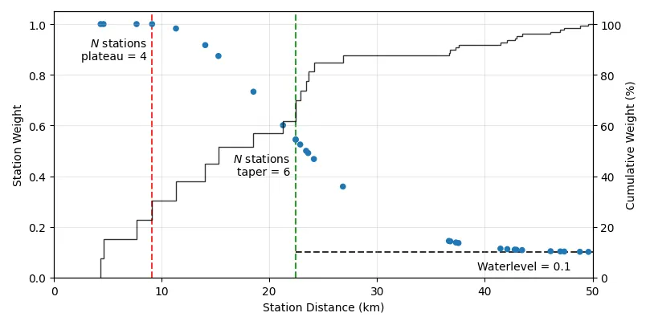

# Station Distance Weighting

Station distance weights are used to give stations close to a node higher weight as it contributes more accurate information about the event's hypocenter. Station weights are calculated for every node to every station in the search volume.

!!! tip
    Station weights play a crucial role for detection and good locations of events.
    While the default parameters are tuned for local and regional networks. The `distance_taper` and `waterlevel` may have to be tuned for different layouts.


/// caption
Distance weights beteen a single node and stations. Shown here is the station weight and cummulative weight for the whole network. With three tuneable parameters: (1) _N_ stations on the plateau, (2) $N$ stations for the Gaussian taper OR (3) distance taper in meters and (4) the waterlevel.
///

```python exec='on'
from qseek.utils import generate_docs
from qseek.distance_weights import DistanceWeights

print(generate_docs(DistanceWeights()))
```
