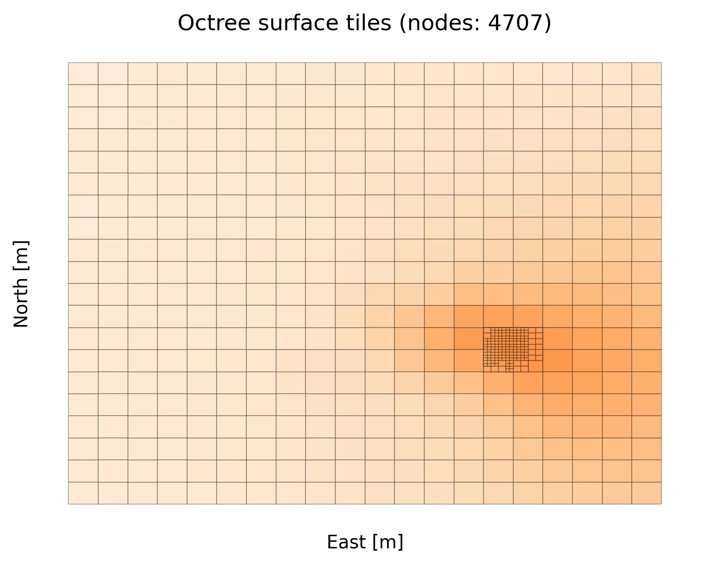

# Octree

A 3D space is searched for sources of seismic energy. Qseek created an octree structure which is iteratively refined when energy is detected, to focus on the source' location. This speeds up the search and improves the resolution of the localisations.



*Surface projection of the refined octree focusing on the seismic source region. In this example four levels of refinement are can be seen, refining the 3D octree from the initial 4000 nodes to 8823 nodes.*

```python exec='on'
from qseek.utils import generate_docs
from qseek.octree import Octree

print(generate_docs(Octree()))
```

::: qseek.octree.Octree
