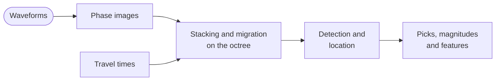
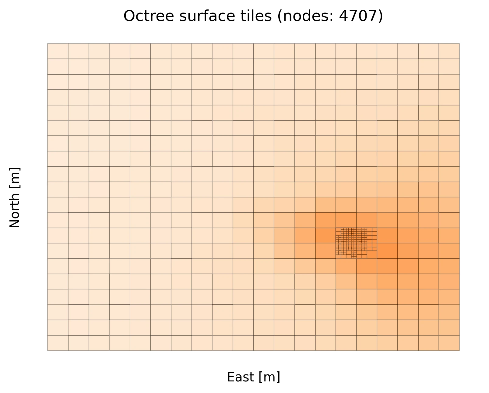

# How Qseek works

Qseek finds earthquakes by stacking. It turns the waveforms of every station into images of phase arrivals, shifts the images by the travel times from a possible source location to the stations, and sums them. Where the shifted arrivals line up, the stack peaks: at the time and location of an earthquake. An adaptive octree focuses the search on the locations where the stack peaks.

This page explains each step and the configuration that controls it.

## Phase images

The [image function](../configuration/image-functions.md) transforms the [pre-processed](../configuration/pre-processing.md) waveforms of each station into characteristic functions of the P and S phase arrivals, the *images*. A machine learning picker from SeisBench, e.g. PhaseNet, annotates the probability of a phase arrival. The STA/LTA image function uses the ratio of a short-term to a long-term average instead.

The [`phase_map`][qseek.images.seisbench.SeisBench.phase_map] of the image function assigns each image to a phase of the ray tracers, e.g. the P image of PhaseNet to `cake:P`.

## Travel times

For every phase, a [ray tracer](../configuration/ray-tracers.md) calculates the travel times from every node of the search volume to every station: for a constant velocity, a 1D layered velocity model or a 3D velocity model. [Station corrections](../configuration/station-corrections.md) add a delay per station and phase, or per station, phase and source location.

## Stacking and migration

For a node $x$ of the search volume, Qseek shifts the image $I_s$ of every station $s$ by the travel time $\tau_s(x)$ and sums the weighted images:

$$
S(x, t) = \sum_{p} w_p \sum_{s} w_s(x) \, I_{s,p}\big(t + \tau_{s,p}(x)\big)
$$

The station weights $w_s(x)$ come from the [distance weighting](../configuration/distance-weighting.md): close stations of a node get full weight, distant stations less. For every node and phase the station weights are normalized to a sum of one, and multiplied by the phase weight $w_p$ of the image function.

Qseek calls the stack $S$ the *semblance*. The maximum semblance over all nodes, $\max_x S(x, t)$, is the detection function of the search.

## Detection

A detection is a peak of the detection function whose height and prominence exceed the [`detection_threshold`][qseek.search.Search.detection_threshold]. With the default `"MAD"`, the threshold is 10 times the median absolute deviation of the detection function in the processed window, so it adapts to the noise level. Peaks closer than the [`detection_blinding`][qseek.search.Search.detection_blinding] are counted as one detection.

Detections at nodes within the absorbing boundary of the search volume are ignored, see [`ignore_boundary`][qseek.search.Search.ignore_boundary].

## Octree refinement

/// caption
The octree refines around a seismic source, from level 0 with 5977 nodes to level 2 with 6812 nodes. Map view (top) and depth section (bottom) of the semblance; the cross marks the maximum.
///

The search starts on a coarse grid of root nodes. For every detection, Qseek splits the node with the maximum semblance, the node with the highest semblance density and their neighbors into eight smaller nodes, and stacks the new nodes. This repeats until the detections fall into nodes of the smallest size, set by the [`n_levels`][qseek.octree.Octree.n_levels] of the [search volume](../configuration/search-volume.md).

Only the nodes around the sources are refined, so the search stays fast in large volumes while the locations reach the resolution of the smallest nodes.

## Location and uncertainty

The location of a detection is the node with the maximum semblance. With [`node_interpolation`][qseek.search.Search.node_interpolation], Qseek interpolates the semblance of the node and its neighbors with radial basis functions and locates the event at the interpolated maximum, within the node.

The location uncertainty is the extent of all nodes whose semblance is within 2 % of the maximum, in east, north and depth direction.

## Phase picks, magnitudes and features

After the location, the picker of the image function picks the P and S arrivals of every station around their modeled arrival times. Qseek then calculates the [magnitudes](../configuration/magnitudes.md) and [event features](../configuration/features.md) of the detection, and notifies the [callbacks](../configuration/callbacks.md).

The differences between the picked and the modeled arrival times are the travel time residuals. [Station corrections](../configuration/station-corrections.md) extract delays from the residuals of a previous run, and a new search with these corrections locates the events more precisely.

## Processing in windows

Qseek processes the waveforms in windows of [`window_length`][qseek.search.Search.window_length], 5 minutes by default. Each window is padded by the range of the travel times plus the blinding times of the image function and the detection. Events at the edge of a window are detected in full, and only once. Shorter windows need less memory.

The search writes its progress into the run directory. If it stops, [continue it](../guides/manage-runs.md#continue-a-search) with `qseek continue`.
