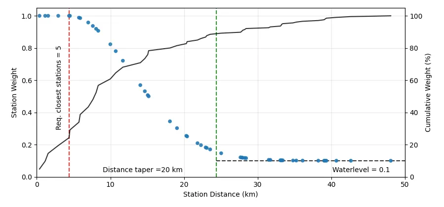

# Station weighting

Station weights decide how much each station contributes to the stack of a node. Every station carries a weight for its information content: stations in dense clusters count less than isolated ones. The closest stations of a node constrain its location best, so they get full weight up to a cumulative station weight; more distant stations are tapered with a Gaussian decay. Qseek calculates a weight for every pair of station and node in the search volume, see [stacking and migration](../concepts/how-it-works.md#stacking-and-migration).


/// caption
Weights of the stations for a single node (dots) and their cumulative weight (line). Three parameters shape the weights: (1) the cumulative weight of the plateau, (2) the cumulative weight of the taper and (3) the waterlevel.
///

- `plateau_weight` is the cumulative station weight of the closest stations that get full weight, 4.0 by default.
- `taper_weight` is the cumulative station weight at which the taper ends, 12.0 by default. Higher values let more distant stations contribute.
- `waterlevel` keeps a minimum weight for distant stations. With the default `0.0`, stations far outside the taper do not contribute.

!!! tip
    The defaults suit local and regional networks. If distant stations should still contribute to the stack, raise the `waterlevel`.

```python exec='on'
from qseek.utils import json_example
from qseek.station_weights import StationWeights

print(json_example(StationWeights()))
```

<div class="qs-config" markdown>

::: qseek.station_weights.StationWeights
    options:
      heading_level: 3

</div>
