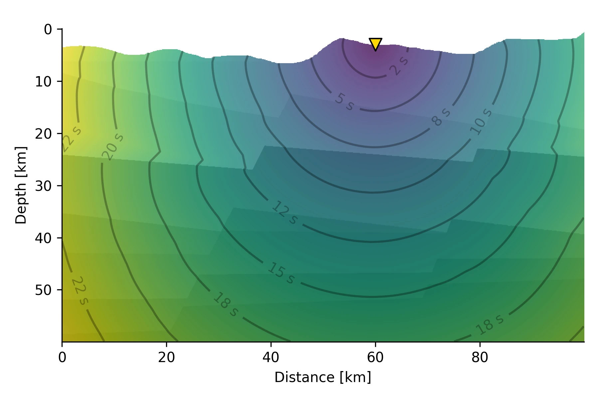
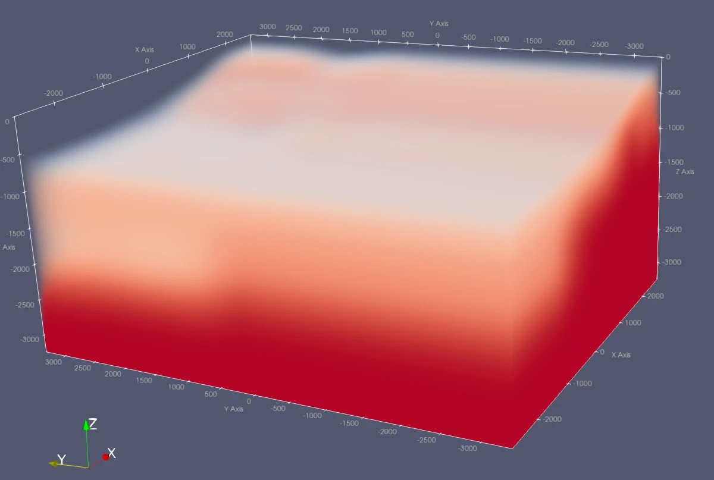

[](){ #qseek.tracers.tracers.RayTracers }

# Ray tracers

Ray tracers calculate the travel times from every node of the search volume to every station. `ray_tracers` is a list: every [phase description](conventions.md#phase-descriptions) in the `phase_map` of the [image function](image-functions.md) needs one ray tracer that provides it.

| Ray tracer | Velocity model | Phases | Use for |
| --- | --- | --- | --- |
| [`ConstantVelocityTracer`](#constant-velocity) | Constant velocity | One per tracer, e.g. `constant:P` | Tests and small volumes |
| [`FastMarching`](#fast-marching) | 1D layered | `fm:P`, `fm:S` | Most searches in 1D models |
| [`CakeTracer`](#pyrocko-cake) | 1D layered | Pyrocko phase definitions, e.g. `cake:P` | Specific phases of 1D models |
| [`FastMarching3D`](#3d-velocity-model) | 3D | One per tracer, e.g. `fm3d:P` | Complex geology |

```json title="Ray tracers for the P and S phases of a 1D model"
"ray_tracers": [
  {
    "tracer": "FastMarching",
    "velocity_model": {"filename": "velocity-model.nd"},
    "phases": ["fm:P", "fm:S"]
  }
]
```

## Constant velocity

The travel time is the distance $d$ divided by the velocity:

$$
t = \frac{d}{v}
$$

Each tracer provides one phase. Add one tracer for P and one for S.

```python exec='on'
from qseek.utils import json_example
from qseek.tracers.constant_velocity import ConstantVelocityTracer

print(json_example(ConstantVelocityTracer()))
```

<div class="qs-config" markdown>

::: qseek.tracers.constant_velocity.ConstantVelocityTracer
    options:
      heading_level: 3

</div>

## 1D layered velocity model

Two ray tracers calculate travel times in 1D layered models. Both read the velocity model from a file in the [Pyrocko Cake](https://pyrocko.org/docs/current/apps/cake/manual.html) `.nd` format or the HYPOSAT format, or from a CRUST2.0 profile. Without a model, Qseek uses a default model and warns.

```python exec='on'
from qseek.utils import json_example
from qseek.tracers.utils import LayeredEarthModel1D

print(json_example(LayeredEarthModel1D(), exclude={"filename", "raw_file_data"}))
```

<div class="qs-config" markdown>

::: qseek.tracers.utils.LayeredEarthModel1D
    options:
      heading_level: 3

</div>

### Fast marching

The fast marching method solves the Eikonal equation for the first arrivals on a grid. It is faster than Pyrocko Cake for large numbers of stations and nodes.


/// caption
Travel times from a station at the surface (yellow triangle) to every point of a heterogeneous subsurface, calculated with the fast marching method. One calculation yields the travel times of a station to all possible source locations.
///

```python exec='on'
from qseek.utils import json_example
from qseek.tracers.fast_marching import FastMarchingTracer

print(json_example(FastMarchingTracer(), exclude={"velocity_model": {"filename", "raw_file_data"}}))
```

<div class="qs-config" markdown>

::: qseek.tracers.fast_marching.FastMarchingTracer
    options:
      heading_level: 3

</div>

### Pyrocko Cake

The [Pyrocko Cake](https://pyrocko.org/docs/current/apps/cake/manual.html#command-line-examples) ray tracer calculates the arrivals of phases given by Pyrocko phase definitions. `"P,p"` is the first P arrival, either the down-going `P` or the up-going `p`. The keys of `phases` are the phase descriptions, e.g. `"cake:P"`.


/// caption
Rays of the Pyrocko Cake ray tracer in a 1D layered model.
///

```python exec='on'
from qseek.utils import json_example
from qseek.tracers.cake import CakeTracer

print(json_example(CakeTracer(), exclude={"earthmodel": {"filename", "raw_file_data"}}))
```

<div class="qs-config" markdown>

::: qseek.tracers.cake.CakeTracer
    options:
      heading_level: 3

</div>

## 3D velocity model

The 3D tracer calculates first arrivals with the fast marching method in a 3D velocity model. Each tracer provides one phase from one velocity model: add one tracer for P with a P-velocity model and one for S. Three velocity models are available:

- A [NonLinLoc](http://alomax.free.fr/nlloc/) 3D velocity grid.
- A 1D layered model, extended to 3D.
- A constant velocity, mainly for testing.

```python exec='on'
from qseek.utils import json_example
from qseek_insights.tracers.fast_marching_3d import FastMarching3DTracer

print(json_example(FastMarching3DTracer()))
```

<div class="qs-config" markdown>

::: qseek_insights.tracers.fast_marching_3d.FastMarching3DTracer
    options:
      heading_level: 3

</div>

<div class="qs-config" markdown>

::: qseek_insights.tracers.fast_marching_3d.NonLinLocVelocityModel
    options:
      heading_level: 3

</div>

### Visualize 3D models

For quality control, Qseek exports all 3D velocity models and travel time volumes as `.vti` files into the `3d-models/` folder of the run directory. Inspect them with [ParaView](https://www.paraview.org/).


/// caption
3D velocity model of the Utah FORGE geothermal test site, visualized in ParaView.
///
