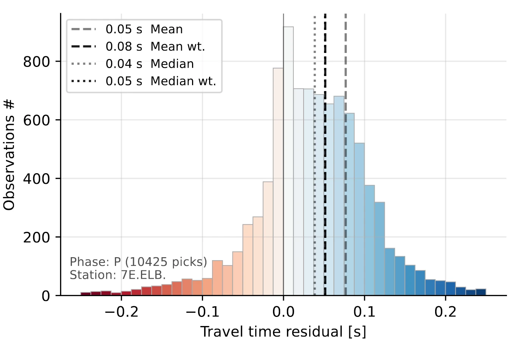
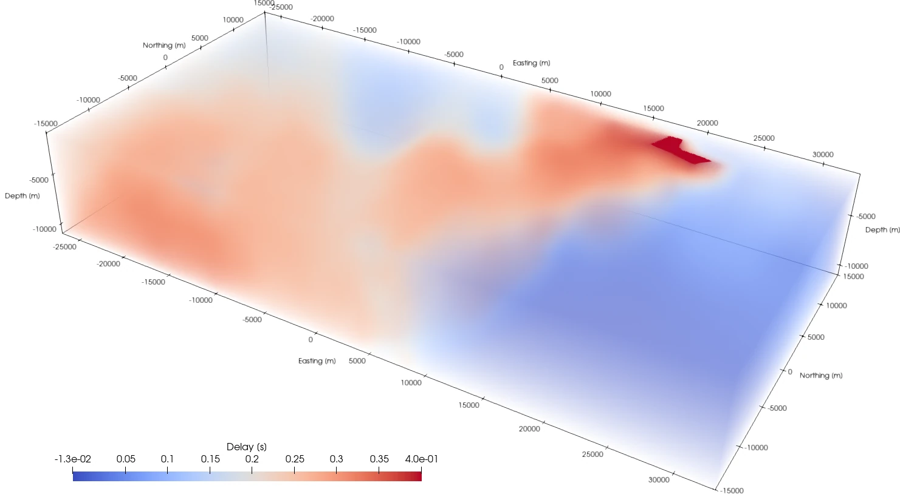

[](){ #qseek.corrections.corrections.StationCorrectionType }

# Station corrections

Station corrections add a delay to the modeled travel times of a station. They account for what the velocity model misses, e.g. the local geology below a station. Corrected travel times line up the phase arrivals better: the locations get more precise, and the stack detects more events.

| Corrections | Delay | Source |
| --- | --- | --- |
| [`SimpleCorrections`](#constant-corrections) | Per station and phase | You give the delays |
| [`StationCorrections`](#station-specific-corrections) | Per station and phase (SST) | Extracted from a previous run |
| [`SourceSpecificStationCorrections`](#source-specific-corrections) | Per station, phase and source location (SSST) | Extracted from a previous run |

`station_corrections` takes the corrections, or the path to a directory with a `corrections.json` file.

## Extract corrections from a previous run

The extracted corrections are statistics of the travel time residuals, the differences between the picked and the modeled arrival times of a previous search:

1. Run a search without corrections. Its run directory holds the detections with their picks.
2. Add the corrections to the configuration, with the run directory of the first search in `import_rundirs`.
3. Run the search again. Qseek extracts the corrections when it starts and applies them to the travel times.

```json title="Station corrections from a previous run"
"station_corrections": {
  "corrections": "StationCorrections",
  "import_rundirs": ["my-search/"]
}
```

## Constant corrections

Constant delays per station and phase, in seconds. Stations and phases without an entry are not corrected.

```json title="Constant station corrections"
"station_corrections": {
  "corrections": "SimpleCorrections",
  "stations": {
    "GE.RUE.": {"cake:P": 0.12, "cake:S": 0.2}
  }
}
```

<div class="qs-config" markdown>

::: qseek.corrections.simple.SimpleCorrections
    options:
      heading_level: 3

</div>

## Station-specific corrections

Station-specific corrections (SST) are one delay per station and phase, extracted from the travel time residuals of all detections of the previous runs.

{ width=600 }
/// caption
Statistics of the station delay times.
///

```python exec='on'
from qseek.utils import json_example
from qseek_insights import StationCorrections

print(json_example(StationCorrections()))
```

<div class="qs-config" markdown>

::: qseek_insights.StationCorrections
    options:
      heading_level: 3

</div>

## Source-specific corrections

Source-specific station corrections (SSST) vary with the source location. The delays are calculated on a grid of octree nodes, at the level set by `resolution_octree_level`, from the weighted travel time residuals of the events within a Gaussian sphere around each node. Between the nodes the delays are interpolated.


/// caption
Delay volume of a single station.
///

```python exec='on'
from qseek.utils import json_example
from qseek_insights import SourceSpecificStationCorrections

print(json_example(SourceSpecificStationCorrections()))
```

<div class="qs-config" markdown>

::: qseek_insights.SourceSpecificStationCorrections
    options:
      heading_level: 3

</div>
