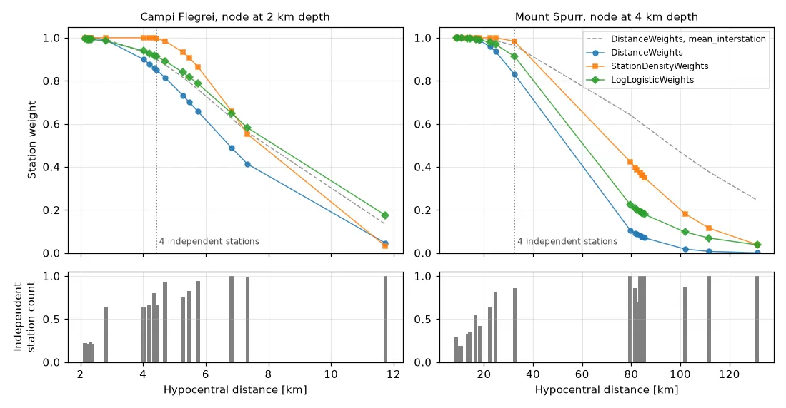
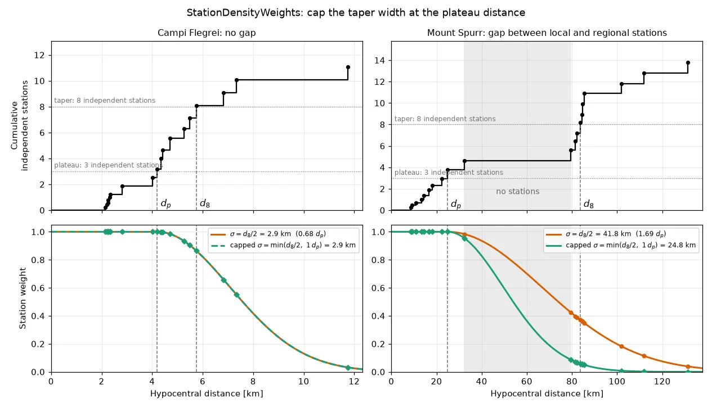

[](){ #qseek.station_weights.StationWeightsType }

# Station weights

Station weights decide how much each station contributes to the stack of a node. Qseek calculates a weight for every pair of station and node in the search volume from their distance, see [stacking and migration](../concepts/how-it-works.md#stacking-and-migration). For every node and phase, the weights are normalized to a sum of one. Close stations get full weight: they record small events with the highest phase confidence and constrain the location best. Distant stations are tapered.

| Station weights | Full weight | Taper |
| --- | --- | --- |
| [`DistanceWeights`](#distance-weights) (default) | The 4 closest stations | Gaussian, 6 times the distance between neighboring stations |
| [`StationDensityWeights`](#station-density-weights) | The closest 3 independent stations | Gaussian, from the distance of the closest 8 independent stations, at most as wide as the plateau |
| [`LogLogisticWeights`](#log-logistic-weights) | The closest 4 independent stations | Log-logistic, half weight at 1.8 times the distance of the plateau |

`station_weights` takes one of them. With `null`, all stations get the same weight.


/// caption
Station weights of a node, with the defaults, for two examples of the [playground](../getting-started/playground.md). Left: Campi Flegrei, 18 stations within 12 km, node at 2 km depth below Solfatara. Right: Mount Spurr, Alaska, node at 4 km depth below sea level beneath the volcano; ten local stations within 32 km and ten regional stations from 79 km to 131 km. Dashed: the taper over twice the mean interstation distance, `"mean_interstation"`. Bottom: the independent station count of each station; the dotted line marks the distance at which the closest stations add up to 4 independent stations.
///

## Independent stations

Stations a few hundred meters apart record nearly the same waveforms and share the errors of the velocity model along their paths. Qseek counts how many *independent stations* each station is worth. An isolated station counts as one independent station. A station in a dense cluster counts as a fraction of one: `1 - (k - k_min) / k_max` with the density `k` of the neighboring stations, a Gaussian kernel as wide as the median distance between neighboring sites. Sensors closer than 50 m, e.g. a broadband and a strong-motion sensor of one site, share a site and together count as the site.

On Campi Flegrei, the 18 INGV stations count as 11.1 independent stations: the six stations in the center of the caldera, 200 m to 500 m apart, count as 0.2 each. At Mount Spurr, the 20 stations count as 13.8 independent stations, the ten local stations as 4.6. Qseek logs the count when the search starts.

`StationDensityWeights` and `LogLogisticWeights` give full weight to the closest stations until they add up to a number of independent stations. In a dense cluster, more stations get full weight than in a sparse network. The independent station counts only set these distances: within the plateau, every station gets full weight.

## Choose the station weights

- **`DistanceWeights`** give the 4 closest stations full weight and taper with an absolute width, the same for all nodes: 6 times the median distance between neighboring stations. Use them for networks of similar station spacing.
- **`StationDensityWeights`** adapt the plateau and the taper to the station spacing around each node. Use them for networks with dense clusters. They have the lowest residuals of the station weights on both Campi Flegrei examples.
- **`LogLogisticWeights`** taper with the distance in units of the plateau distance of each node. The taper follows the phase confidence of small events, which falls off with the distance relative to the closest stations in the same way on different networks. They find the most detections with at least 8 picks on the 10-day Campi Flegrei example and at Mount Spurr, at slightly larger residuals.

!!! tip
    Start with the default `DistanceWeights`. If your network mixes dense clusters with sparse stations, compare `StationDensityWeights` and `LogLogisticWeights` on a first run.

### Results

The three examples of the [playground](../getting-started/playground.md), searched with each station weights and their defaults, `MADTrigger` with `mad_factor` 10. The first row of each example is the taper of earlier Qseek versions, `"mean_interstation"`:

| Example | Station weights | Detections | With ≥ 8 picks | Residual RMS, median | Catalog events matched | Epicenter offset, median |
| --- | --- | --- | --- | --- | --- | --- |
| Campi Flegrei, 1 day, 18 stations | `DistanceWeights`, `"mean_interstation"` | 732 | 521 | 0.284 s | 45 / 45 | 241 m |
| | `DistanceWeights` | 750 | 525 | 0.286 s | 45 / 45 | 238 m |
| | `StationDensityWeights` | 954 | 524 | 0.282 s | 45 / 45 | 216 m |
| | `LogLogisticWeights` | 800 | 520 | 0.286 s | 45 / 45 | 229 m |
| Campi Flegrei, 10 days, 19 stations | `DistanceWeights`, `"mean_interstation"` | 6379 | 3750 | 0.278 s | 209 / 211 | 280 m |
| | `DistanceWeights` | 6614 | 3772 | 0.280 s | 209 / 211 | 293 m |
| | `StationDensityWeights` | 8189 | 3799 | 0.278 s | 210 / 211 | 295 m |
| | `LogLogisticWeights` | 7092 | 3800 | 0.284 s | 210 / 211 | 332 m |
| Mount Spurr, 3 days, 10 local and 10 regional stations | `DistanceWeights`, `"mean_interstation"` | 1758 | 1046 | 0.349 s | 228 / 234 | 416 m |
| | `DistanceWeights` | 2210 | 1070 | 0.318 s | 230 / 234 | 348 m |
| | `StationDensityWeights` | 2457 | 1140 | 0.338 s | 229 / 234 | 409 m |
| | `LogLogisticWeights` | 2226 | 1127 | 0.364 s | 230 / 234 | 416 m |

At Mount Spurr, the taper over twice the mean interstation distance, 166 km, keeps the regional stations 80 km to 130 km away at weights of 0.25 to 0.65. They rarely record the small events of the swarm. The default taper of 74 km, 6 times the 12.3 km between neighboring stations, finds 26% more detections and moves the epicenters 67 m closer to the catalog. On the dense Campi Flegrei network, the two tapers are 9.0 km and 11.1 km and give nearly the same detections.

A synthetic benchmark tests the station weights on 6 hours of phase confidences for each of four networks, two random realizations each: an observatory cluster with co-located sensors and a regional ring; a regional network with a dense sub-array; the station layouts of Campi Flegrei and Mount Spurr. Arrivals of synthetic events, Gutenberg-Richter magnitudes, have confidences from their signal-to-noise ratio and travel times through a heterogeneous velocity model; noisy stations add false peaks. The table gives the share of the events with at least 6 picks that each station weights detect at 2 false detections per hour, and the median change of the location error against `"mean_interstation"`, paired by event:

| Station weights | Observatory | Regional | Campi Flegrei | Mount Spurr | Location change |
| --- | --- | --- | --- | --- | --- |
| `DistanceWeights`, `"mean_interstation"` | 0.65 | 0.23 | 1.00 | 0.76 | 0 m |
| `DistanceWeights` | 0.60 | 0.38 | 1.00 | 0.78 | −1 m to 4 m |
| `StationDensityWeights` | 0.86 | 0.38 | 1.00 | 0.86 | −1 m to 5 m |
| `LogLogisticWeights` | 0.80 | 0.38 | 1.00 | 0.78 | −1 m to 4 m |

The station weights hardly change the location of an event once it is detected. They change which events the stack detects.

## Distance weights

The `required_closest_stations` closest stations of a node get full weight, 4 by default. More distant stations are tapered with a Gaussian function; `distance_taper` is its full width at half maximum. By default it adapts to the network, `"nearest_neighbor"`: 6 times the median distance between neighboring station sites. `"mean_interstation"` uses twice the mean interstation distance, the default of earlier Qseek versions. `waterlevel` keeps a minimum weight for distant stations; with the default `0.0`, stations far outside the taper do not contribute.

```python exec='on'
from qseek.utils import json_example
from qseek.station_weights import DistanceWeights

print(json_example(DistanceWeights()))
```

<div class="qs-config" markdown>

::: qseek.station_weights.DistanceWeights
    options:
      heading_level: 3

</div>

## Station density weights

The closest stations of a node get full weight until they add up to `plateau_stations` independent stations, 3 by default. Beyond this plateau distance, a Gaussian taper decays; its standard deviation is half the distance at which the closest stations add up to `taper_stations`, 8 by default. When the network has fewer independent stations than `taper_stations`, the most distant station sets the width.

A gap in the network can put the `taper_stations` far away. At Mount Spurr, the ten local stations within 32 km count as 4.6 independent stations; the closest stations add up to 8 only among the regional stations beyond 79 km. The taper would then reach across the gap and keep the regional stations at weights of up to 0.43. `max_taper_ratio` caps the standard deviation of the taper at the plateau distance, 1.0 by default. Without a gap the cap rarely binds: on Campi Flegrei the standard deviation is 0.77 times the plateau distance (median over the nodes), and the cap binds at 12% of the nodes. With a standard deviation of one plateau distance, the weight is 0.5 at 2.2 times the plateau distance, where the mean phase confidence of small events halves on the playground examples.


/// caption
The cap of the taper on two nodes of the playground examples. Top: the closest stations add up to independent stations; $d_p$ marks 3 independent stations, the plateau, $d_8$ marks 8, which sets the taper width $\sigma = d_8 / 2$. Bottom: the station weights without the cap (orange) and with `max_taper_ratio` 1.0 (green). Left: on Campi Flegrei, without a gap, the cap does not bind. Right: at Mount Spurr, $d_8$ lies beyond the gap between the local and the regional stations; the cap halves the taper width, from 41.8 km to 24.8 km, and lowers the weights of the regional stations to 0.09 and less.
///

On the playground, the cap of 1.0 finds 12% and 14% more detections on Campi Flegrei (1 and 10 days) and 20% more at Mount Spurr than no cap, with 59 more detections with at least 8 picks at Mount Spurr. A cap of 0.75 raises the residuals on Campi Flegrei, caps of 1.25 and 1.5 move the epicenters at Mount Spurr farther from the catalog.

The independent station counts depend on the available stations. When a station has no data in a window, Qseek counts the remaining stations.

```python exec='on'
from qseek.utils import json_example
from qseek.station_weights import StationDensityWeights

print(json_example(StationDensityWeights()))
```

<div class="qs-config" markdown>

::: qseek.station_weights.StationDensityWeights
    options:
      heading_level: 3

</div>

## Log-logistic weights

The plateau distance $d_p$ of a node is the distance at which the closest stations add up to `plateau_stations` independent stations, 4 by default. A station at distance $d$ gets the weight

$$
w(d) = \frac{1}{1 + \left(\dfrac{d}{s \, d_p}\right)^{n}}
$$

with the `taper_scale` $s$, 1.8 by default, and the `taper_exponent` $n$, 4 by default. Stations within the plateau get almost full weight, 0.91 at the plateau distance. The weight is 0.5 at 1.8 times the plateau distance and 0.13 at 2.9 times.

The shape comes from the phase confidences of three playground runs: on Campi Flegrei (1 day and 10 days) and Mount Spurr, the mean PhaseNet confidence falls to half at 2.1 to 2.4 times the distance of the 4th closest station, with exponents of 3.2 to 4.4. The plateau of independent stations reaches farther than the 4th closest station in dense clusters; on the three examples and the synthetic benchmark, `taper_scale` 1.8 detects more events than 2.2. Raise `taper_scale` to let more distant stations contribute, e.g. when your events are larger than the smallest events of the catalog.

```python exec='on'
from qseek.utils import json_example
from qseek.station_weights import LogLogisticWeights

print(json_example(LogLogisticWeights()))
```

<div class="qs-config" markdown>

::: qseek.station_weights.LogLogisticWeights
    options:
      heading_level: 3

</div>
