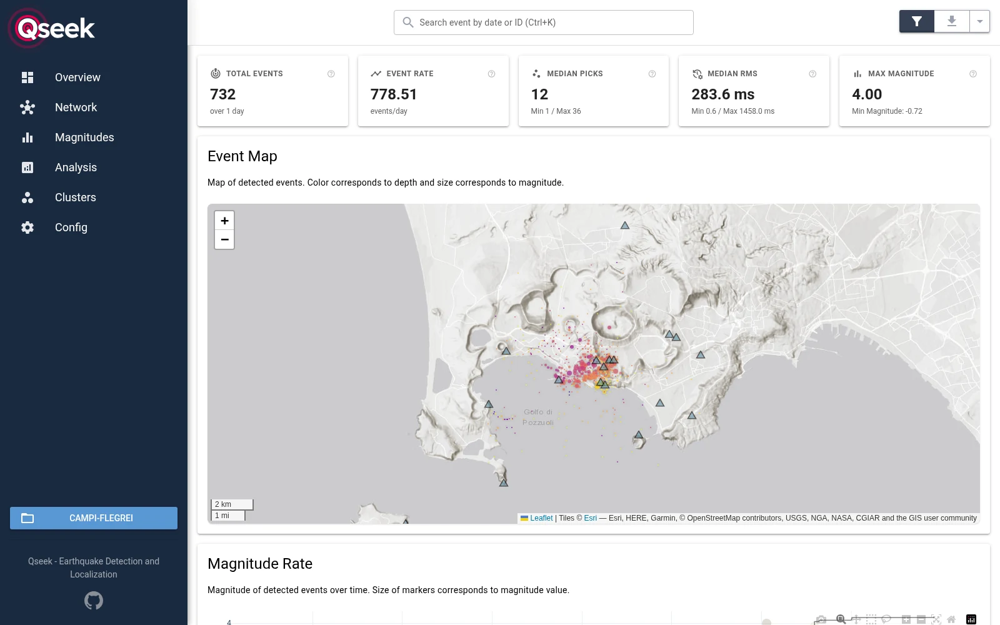
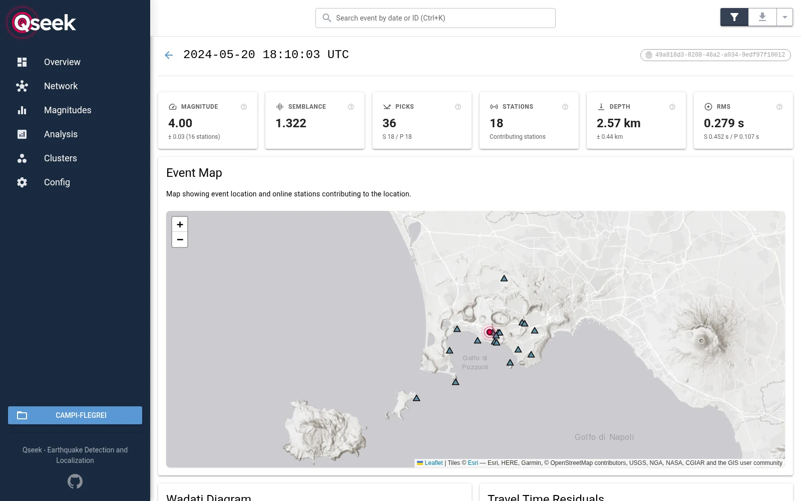
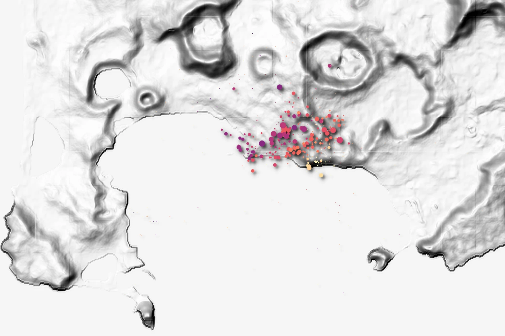

# Quick start: Campi Flegrei

In this tutorial you detect and locate the earthquakes of one day at [Campi Flegrei](https://en.wikipedia.org/wiki/Campi_Flegrei), the volcanic caldera west of Naples, Italy. On 20 May 2024, an Md 4.4 earthquake struck the caldera during a swarm. You download the waveforms of the INGV seismic network, set up the search and look at the detected earthquakes.

You need Python 3.12 or newer, about 1 GB of disk space, and a few minutes.

## Install

Install Qseek, as described in [Installation](installation.md), and [FDSN Rush](https://miili.github.io/FDSN-rush/), which downloads the waveforms:

```sh
pip install qseek fdsn-rush
```

Create a directory for the project:

```sh
mkdir campi-flegrei && cd campi-flegrei
```

## Download the data

Write the download configuration for FDSN Rush. It requests one day of waveforms of 19 stations from the [INGV](https://www.ingv.it/) FDSN web services:

```json title="download.json"
{
  "writer": {"sds_archive": "sds"},
  "clients": [{"url": "https://webservices.ingv.it/"}],
  "metadata_path": "metadata",
  "time_range": ["2024-05-20", "2024-05-21"],
  "station_selection": [
    "IV.CAAM",
    "IV.CAWE",
    "IV.CBAC",
    "IV.CBAG",
    "IV.CCAP",
    "IV.CFMN",
    "IV.CMIS",
    "IV.CMSN",
    "IV.CMTS",
    "IV.CNIS",
    "IV.COLB",
    "IV.CPIS",
    "IV.CPOZ",
    "IV.CQUE",
    "IV.CSFT",
    "IV.CSOB",
    "IV.CSTH",
    "IV.PTMR",
    "IX.NAPI"
  ],
  "channel_priority": ["HH[ZNE12]", "EH[ZNE12]", "HN[ZNE12]"],
  "min_channels_per_station": 3,
  "max_sampling_rate": 200.0
}
```

Download the waveforms into an SDS archive in `sds/` and the station metadata into `metadata/`:

```sh
fdsn-rush download download.json
```

The download takes a few minutes and ends with `All downloads completed successfully.` FDSN Rush prefers the broadband `HH` channels, falls back to the short-period `EH` and the strong-motion `HN` channels, and takes a station only with all three components.

Of the 19 stations, 18 recorded on that day: `IV.CAWE` had no channels in May 2024, so FDSN Rush skips it. The archive holds about 1 GB of waveforms.

## Get the velocity model

Download the 1D velocity model of Campi Flegrei into the project directory: [:lucide-download: campi-flegrei.nd](campi-flegrei.nd){ download }

The model is in the [Pyrocko Cake](https://pyrocko.org/docs/current/apps/cake/manual.html) `.nd` format. Each line is a depth in km, the P and S velocity in km/s and the density in g/cm³:

```text title="campi-flegrei.nd"
--8<-- "docs/getting-started/campi-flegrei.nd"
```

## Configure the search

Write the search configuration:

```json title="campi-flegrei.json"
{
  "stations": {
    "station_xmls": ["metadata/"]
  },
  "data_provider": {
    "provider": "SDSArchive",
    "archive": "sds/"
  },
  "octree": {
    "location": {"lat": 40.827, "lon": 14.139},
    "root_node_size": 1000.0,
    "n_levels": 4,
    "east_bounds": [-6000.0, 6000.0],
    "north_bounds": [-6000.0, 6000.0],
    "depth_bounds": [0.0, 6000.0]
  },
  "image_function": {
    "image": "SeisBench",
    "model": "PhaseNet",
    "pretrained": "volpick",
    "phase_map": {"P": "fm:P", "S": "fm:S"}
  },
  "ray_tracers": [
    {
      "tracer": "FastMarching",
      "velocity_model": {"filename": "campi-flegrei.nd"},
      "phases": ["fm:P", "fm:S"]
    }
  ],
  "magnitudes": [
    {"magnitude": "LocalMagnitude", "model": "campi-flegrei"}
  ]
}
```

- **Stations and waveforms:** the StationXML files in `metadata/` and the SDS archive in `sds/`, both from FDSN Rush.
- **Search volume:** a 12 km × 12 km × 6 km volume, centered on the caldera. The 1 km root nodes are refined over 4 levels down to 125 m.
- **Image function:** PhaseNet with the `volpick` weights. We compared the `original`, `volpick` and `instance` weights on this day: `volpick` gave the fewest weak detections and the most phase picks per event.
- **Travel times:** the fast marching ray tracer calculates the P and S travel times in the velocity model. The `phase_map` assigns the P and S images of PhaseNet to its phases `fm:P` and `fm:S`.
- **Magnitudes:** local magnitudes with the attenuation model of Campi Flegrei ([Petrosino et al., 2008](https://doi.org/10.1785/0120070131)).

Everything else keeps its default; [the configuration overview](../configuration/index.md) explains all fields.

## Run the search

```sh
qseek search campi-flegrei.json
```

Qseek prepares the travel times, then processes the day in windows of 5 minutes. On a workstation with an NVIDIA GeForce RTX 4060, the search takes about 100 seconds; without a GPU it takes longer. The search ends with:

```text
INFO     finished search in 0:01:36.357628
INFO     detected 732 events
```

Two warnings are expected for this data: `IV.CCAP` has gaps on that day, and the smallest events have too few stations within the 8 km range of the magnitude model for a local magnitude.

## Look at the results

The search writes its results into the [run directory](../results/run-directory.md) `campi-flegrei/`. Qseek detected 732 events on 20 May 2024; 521 of them have at least eight phase picks. 298 detections have a local magnitude, from ML −0.7 to 4.0.

The [INGV event catalog](https://webservices.ingv.it/fdsnws/event/1/) lists 45 earthquakes within 0.1° of the caldera on that day, from Md 1.0 to the Md 4.4 main shock. Qseek detects all 45 of them. Its epicenters are a median 241 m from the INGV locations, its depths a median 141 m.

### In the web UI

Open the run in the browser:

```sh
qseek explore campi-flegrei/
```

=== "Overview"

    
    /// caption
    The overview of the run: 732 detections, colored by depth and scaled by magnitude. The triangles are the 18 stations.
    ///

=== "ML 4.0 event"

    
    /// caption
    The strongest detection, ML 4.0 at 18:10 UTC, located at 2.57 km depth with 36 picks at 18 stations.
    ///

The [web UI](../results/explore.md#web-ui) also shows the magnitude statistics, a Wadati diagram and every single detection.

### In QGIS

Load `campi-flegrei/csv/detections.csv` into [QGIS](../results/explore.md#qgis) as a delimited text layer, with the geometry from the `WKT_geom` column. [Explore results](../results/explore.md#qgis) walks you through it.


/// caption
The detections of this tutorial in QGIS, on a hillshade of Campi Flegrei. The symbol size shows the semblance, the color the depth: light colors are shallow, dark colors deep.
///

### With the waveforms

Inspect the picks and the waveforms of the detections in Pyrocko Snuffler:

```sh
qseek snuffler campi-flegrei/ --show-observed --show-modelled
```

## Next steps

- The [playground](playground.md) runs this example with one command per step and compares searches with different settings.
- [How Qseek works](../concepts/how-it-works.md) explains the steps of the search.
- [Tune the detection](../guides/tune-detection.md) shows how to check and improve the results.
- [Station corrections](../configuration/station-corrections.md) refine the locations in a second search.
