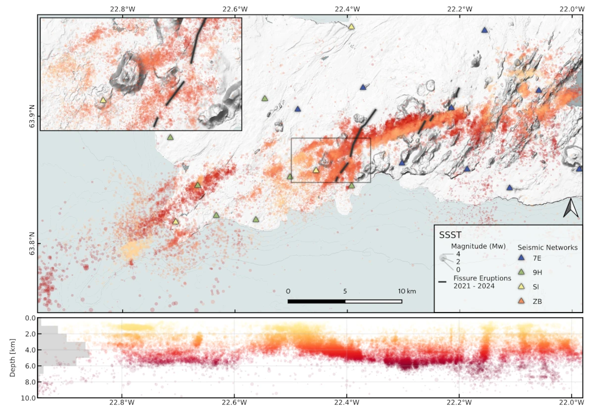

# Welcome to Qseek 🔥

Qseek is an earthquake detection and localisation framework. It combines modern **machine learning phase detection and robust migration and stacking techniques**.

The detector is leveraging [Pyrocko](https://pyrocko.org) and [SeisBench](https://github.com/seisbench/seisbench), it is highly-performant and can search massive data sets for seismic activity efficiently.

!!! abstract "Citation"
    Isken, M., Niemz, P., Münchmeyer, J., Büyükakpınar, P., Heimann, S., Cesca, S., Vasyura-Bathke, H., & Dahm, T. (2025). Qseek: A data-driven Framework for Automated Earthquake Detection, Localization and Characterization. Seismica, 4(1). [https://doi.org/10.26443/seismica.v4i1.1283](https://doi.org/10.26443/seismica.v4i1.1283)

/// caption
Seismic swarm activity in Iceland, Reykjanes Peninsula during a 2020 unrest. 30k+ earthquakes detected, outlining a dike intrusion, preceeding the 2021 Fagradasfjall eruption.
///

## Features

* [x] Earthquake phase detection using machine-learning pickers from [SeisBench](https://github.com/seisbench/seisbench)
  * [x] [PhaseNet (Zhu and Beroza, 2018](https://doi.org/10.1093/gji/ggy423)
  * [x] [EQTransformer (Mousavi et al., 2020)](https://doi.org/10.1038/s41467-020-17591-w)
  * [x] [OBSTransformer (Niksejel and Zahng, 2024)](https://doi.org/10.1093/gji/ggae049)
  * [x] LFEDetect
* [x] Octree localisation approach for efficient and accurate search
* [x] Different velocity models:
  * [x] Constant velocity
  * [x] 1D Layered velocity model
  * [x] 3D fast-marching velocity model (NonLinLoc compatible)
* [x] Extraction of earthquake event features:
  * [x] Local magnitudes
  * [x] Ground motion attributes
* [x] Automatic extraction of modelled and picked travel times
* [x] Calculation and application of station corrections / station delay times
* [x] Real-time analytics on streaming data (e.g. SeedLink)

[Get Started!](getting_started.md){ .md-button }

## Supported by

[{ width="240" padding-right="100" }](https://gfz.de)
[{ width="200" padding-right="100" }](https://github.com/seisbench/seisbench)
[{ width="45" padding-right="100" }](https://pyrocko.org)
