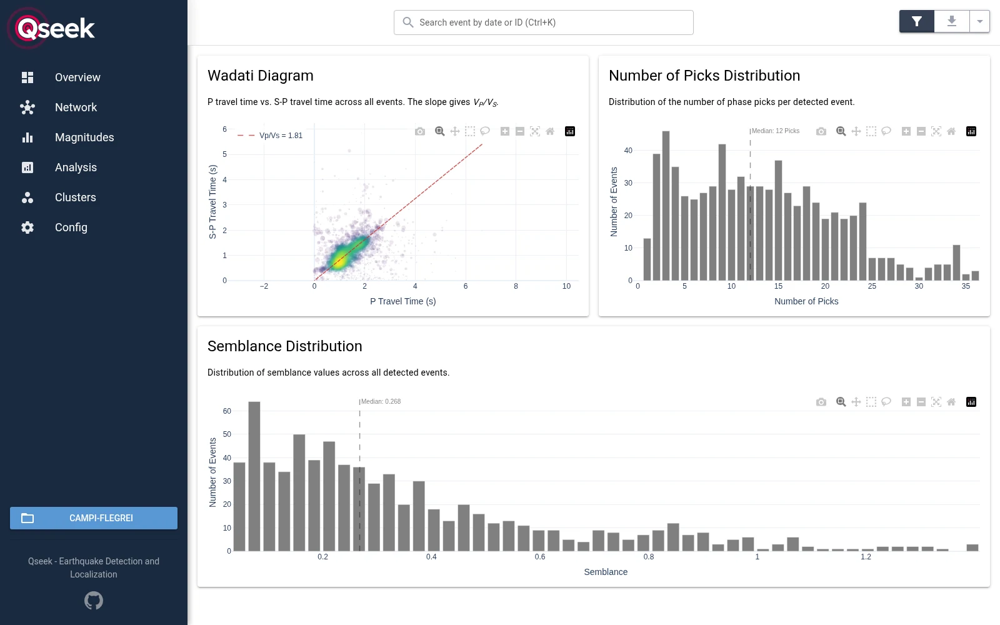
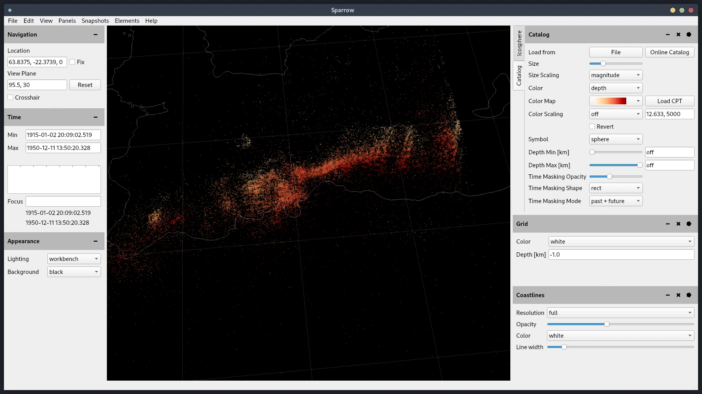
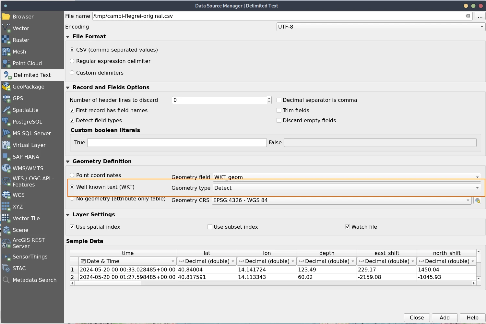
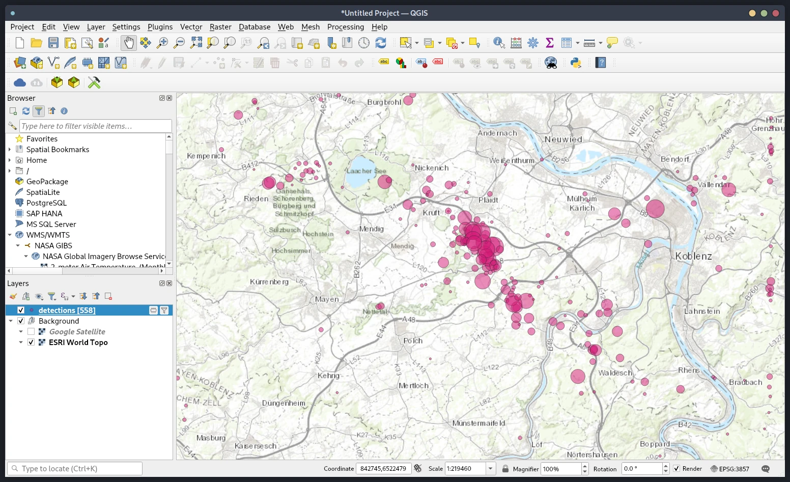

# Explore results

Qseek writes the detections as JSON, CSV and Pyrocko files into the [run directory](run-directory.md). You can explore them in the web UI, in Pyrocko Snuffler and Sparrow, or in QGIS.

## Web UI

Explore the detections, magnitudes and stations of a run in the browser. To explore a run on a remote machine, give its path as an `ssh://user@host/path` URL: Qseek copies the detections over SSH and checks for new detections every minute. The remote machine needs SSH access and Python 3, but no Qseek installation.

```sh title="Start the web UI"
qseek explore my-search/
qseek explore ssh://user@host/path/to/my-search
```

The web UI opens on port 2213; set another port with `--port`. The screenshots show the run of the [quick start](../getting-started/quick-start.md) at Campi Flegrei.

=== "Overview"

    
    /// caption
    Key numbers of the run and a map of the detections, colored by depth and scaled by magnitude. The triangles are the stations.
    ///

=== "Event"

    
    /// caption
    A single detection, here the ML 4.0 event at 18:10 UTC, with its magnitude, picks, depth and residuals, and the stations that contribute to the location.
    ///

=== "Analysis"

    
    /// caption
    The Wadati diagram with the Vp/Vs ratio, and the distributions of the number of picks and of the semblance.
    ///

Search a detection by its date or ID with ++ctrl+k++. The sidebar leads to the station network, the magnitude statistics, the clusters and the configuration of the run.

## Pyrocko Snuffler

Inspect the waveforms together with the detections and the observed and modeled phase picks.

```sh title="Inspect waveforms and picks"
qseek snuffler my-search/ --show-observed --show-modelled
```

## Pyrocko Sparrow

[Pyrocko Sparrow](https://pyrocko.org/docs/current/apps/sparrow/index.html) shows large sets of detections in 3D, together with the stations and other Pyrocko data. Load `pyrocko_detections.list` and `pyrocko_stations.yaml` from the run directory.


/// caption
Detections on the Reykjanes Peninsula in Pyrocko Sparrow.
///

## QGIS

[QGIS](https://www.qgis.org/) shows the detections on a map, together with your own geodata. Load `csv/detections.csv` of the run directory as a delimited text layer:

1. Open **Layer › Add Layer › Add Delimited Text Layer**.
2. Select `csv/detections.csv` as **File name**. The format is **CSV**, and the first record has the field names.
3. Under **Geometry Definition**, choose **Well known text (WKT)** with the geometry field `WKT_geom`, and the geometry CRS **EPSG:4326 - WGS 84**.
4. Click **Add**.


/// caption
Loading the detections as a delimited text layer in QGIS, with the geometry from the `WKT_geom` column.
///

Style the layer by the columns of the [detections](run-directory.md#detections), e.g. the `depth`, the `semblance` or the magnitude. For maps, the `csv/detections_jittered.csv` file avoids the grid pattern of the octree nodes.


/// caption
Detections in QGIS, styled by their attributes.
///

## Export detections

Qseek exports the detections to other formats, e.g. a HypoDD project for double-difference relocation or a VELEST project for velocity model inversion. See [exporters](exporters.md).
