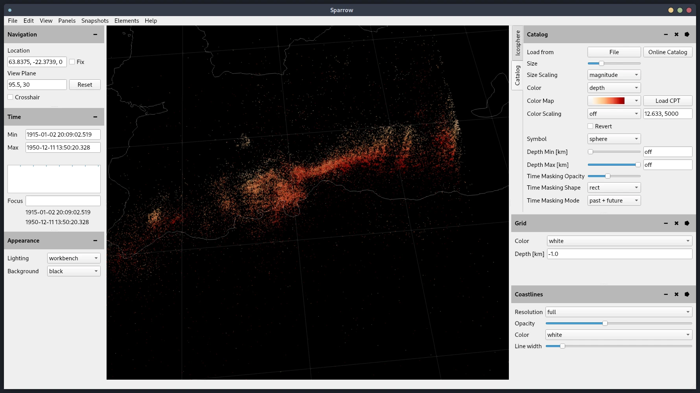
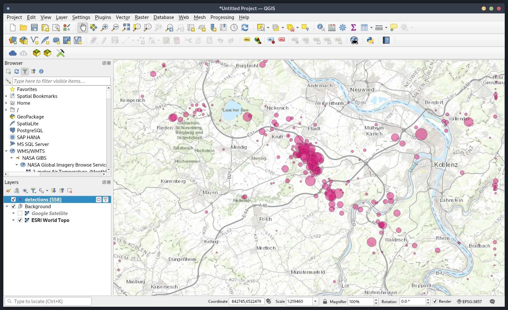

# Visualizing Detections

The event detections are exported in Qseek-native JSON, Pyrocko YAML format and as CSV files.

## Pyrocko Sparrow

For large data sets use the [Pyrocko Sparrow](https://pyrocko.org) to visualise seismic event detections in 3D. Also seismic stations and many other features from the Pyrocko ecosystem can be integrated into the view.

## QGIS

[QGIS](https://www.qgis.org/) can be used to import `.csv` and explore the data in an interactive fashion. Detections can be rendered by e.g. the detection semblance or the calculated magnitude.

